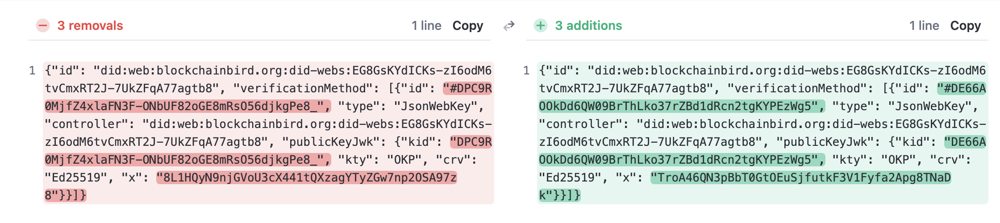
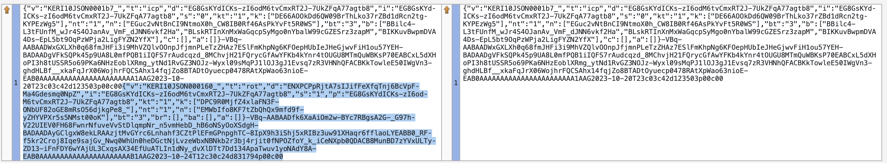

# did:webs IIW37 Tutorial

If you're running into trouble in the process below, be sure to check the section [Trouble Shooting](#trouble-shooting) below. 

## Run Docker containers with keripy and dkr

```
docker compose down
docker compose up -d
docker compose exec dkr /bin/bash
```

## Create salt (seed) for AID private keys

```
kli salt
```

Example response:

```
0AAQmsjh-C7kAJZQEzdrzwB7
```

## Create AID

Note: Replace with your actual salt

```
kli init --name controller --salt 0AAQmsjh-C7kAJZQEzdrzwB7 --nopasscode --config-dir "/keripy/my-scripts" --config-file my-config
kli incept --name controller --alias controller --file "/keripy/my-scripts/my-incept.json"
```

Example AID:

```
EKYGGh-FtAphGmSZbsuBs_t4qpsjYJ2ZqvMKluq9OxmP
```

## (Optional) Perform more KERI operations

Optionally use `kli` to perform additional KERI operations such as key rotation, threshold signatures, etc., see KERI docs for details.

See [an example](#example-key-rotation) below.


## Decide your web address for did:webs

Find a web address (domain, optional port, optional path) that you control.

Example web address:

```
https://peacekeeper.github.io/did-webs-iiw37-tutorial/
```

## Generate did:webs files for AID

Note: Replace with your actual web address and AID, convert to did:web(s) conformant identifier

Be sure to execute the command in the root of your local `did-webs` repo (and in the Docker container)
```
dkr did webs generate --name controller --did did:webs:peacekeeper.github.io:did-webs-iiw37-tutorial:EKYGGh-FtAphGmSZbsuBs_t4qpsjYJ2ZqvMKluq9OxmP --oobi http://witnesshost:5642/oobi/EKYGGh-FtAphGmSZbsuBs_t4qpsjYJ2ZqvMKluq9OxmP/witness/BBilc4-L3tFUnfM_wJr4S4OJanAv_VmF_dJNN6vkf2Ha
```

This creates files:
-  `did.json` under local path `./volume/dkr/did_json/<your AID>`
-  `keri.cesr` under local path `./volume/dkr/keri_cesr/<your AID>`

You can access these files either from within your Docker container or on your local computer filesystem.
- `<local path on computer to did-webs-iiw37-tutorial>/volume/dkr/` 
- `/usr/local/var/did-keri-resolver/did_json/<your AID>` (local path in the Docker container)

and extend those paths with either `did_json/<your AID>` or `keri_cesr/<your AID>`.


## Upload did.json and keri.cesr to your web server

E.g. using git, Github pages, FTP, SCP, etc.

### Example WOT-terms install using git

We choose `WOT-terms` as our [DESTINATION LOCAL REPO]

```
cd [PATH TO LOCAL SOURCE REPO did-webs-iiw37-tutorial]/volume/dkr/did_json/ENbWS51Pw1rmxz5QIfK5kp3ODaEeQcZjqQNrLpc6mMQq
cp did.json ~/apps/WOT-terms/
cd ../../keri_cesr/ENbWS51Pw1rmxz5QIfK5kp3ODaEeQcZjqQNrLpc6mMQq
cp keri.cesr ~/apps/WOT-terms/
```

Result in local WOT-terms repo
```
[DESTINATION LOCAL REPO]: git status

Untracked files:
  (use "git add <file>..." to include in what will be committed)
	did.json
	keri.cesr

git add .
git commit -m "prepare upload did:webs documents to WOT-terms"  
git push upstream main
```
If you get the expected output of the push action, the files are on the controlled webserver.

## Check if files are available on your server

Note: Replace with your actual web address and AID

https://peacekeeper.github.io/did-webs-iiw37-tutorial/EKYGGh-FtAphGmSZbsuBs_t4qpsjYJ2ZqvMKluq9OxmP/did.json

https://peacekeeper.github.io/did-webs-iiw37-tutorial/EKYGGh-FtAphGmSZbsuBs_t4qpsjYJ2ZqvMKluq9OxmP/keri.cesr


## (Optional) Resolve AID as did:keri using local resolver

Optionally resolve the AID locally as did:keri, given an OOBI as resolution option.

Note: Replace with your actual AID

```
dkr did keri resolve --name controller --did did:keri:EKYGGh-FtAphGmSZbsuBs_t4qpsjYJ2ZqvMKluq9OxmP --oobi http://witnesshost:5642/oobi/EKYGGh-FtAphGmSZbsuBs_t4qpsjYJ2ZqvMKluq9OxmP/witness/BBilc4-L3tFUnfM_wJr4S4OJanAv_VmF_dJNN6vkf2Ha
```

## (Optional) Resolve AID as did:webs using local resolver

Optionally resolve the AID locally as did:webs.

Note: Replace with your actual web address and AID

```
dkr did webs resolve --name controller --did did:webs:peacekeeper.github.io:did-webs-iiw37-tutorial:EKYGGh-FtAphGmSZbsuBs_t4qpsjYJ2ZqvMKluq9OxmP
```

## Resolve as did:web using Universal Resolver

https://dev.uniresolver.io/#did:web:peacekeeper.github.io:did-webs-iiw37-tutorial:EKYGGh-FtAphGmSZbsuBs_t4qpsjYJ2ZqvMKluq9OxmP

## Resolve as did:webs using Universal Resolver

https://dev.uniresolver.io/#did:webs:peacekeeper.github.io:did-webs-iiw37-tutorial:EKYGGh-FtAphGmSZbsuBs_t4qpsjYJ2ZqvMKluq9OxmP

## Example key rotation

Use the following two commands in your running Docker container.

```
kli rotate --name controller --alias controller
```
Be sure to repeat the `dkr webs generate` command:
```
dkr did webs generate --name controller --did did:webs:blockchainbird.org:did-webs:EG8GsKYdICKs-zI6odM6tvCmxRT2J-7UkZFqA77agtb8 --oobi http://witnesshost:5642/oobi/EG8GsKYdICKs-zI6odM6tvCmxRT2J-7UkZFqA77agtb8/witness/BBilc4-L3tFUnfM_wJr4S4OJanAv_VmF_dJNN6vkf2Ha
```
Now upload the overwritten `did.json` and `keri.cesr` again to the public spot.

### Result

A diff comparison of the old (in green) and the new (in red) **did.json**:

A diff comparison of the old (right) and the new (left) **keri.cesr**; in blue the added part:


## Trouble shooting

### If you are using an Apple Silicon (M1) mac then you might need to:
* In Docker, select `Use Rosetta for x86/amd64 emulation on Apple Silicon`
* Before running docker compose `export DOCKER_DEFAULT_PLATFORM=linux/amd64`

### Your docker container is already up- and running?

#### Do you have a witness up for another identifier?
Then the `kli incept --name controller --alias controller --file "/keripy/my-scripts/my-incept.json"` command will give this response:

`ERR: Already incepted pre=[Your prefix of another AID].`
 
#### Solution
Various solutions if you're a Docker expert. If not, we'll go down the more rigorous path:

1. Step out of the running container with `exit` 
2. and then `docker compose down`. This should respond with:

[+] Running 3/3
 ⠿ Container dkr                            Removed                                                                                                                                                                              0.0s
 ⠿ Container witnesshost                    Removed                                                                                                                                                                             13.7s
 ⠿ Network did-webs-iiw37-tutorial_default  Removed                                                                                                                                                                              3.1s
Now you could continue with:
```
docker compose up -d
docker compose exec dkr /bin/bash
```
### Special attention Github Pages: web address
There's no problem that we know of when you use Github pages in a bare-bones manner. However, if you use static page generators to populate your github pages (e.g. Jekyll or Docusaurus) be sure to choose the right spot of your files and extract the right paths of the links needed to resolve:

#### Example
This is the web address of the `docusaurus` directory:
https://weboftrust.github.io/WOT-terms/test/did-webs-iiw37-tutorial/

But the exact spot to extract the files as text would be something like:
```
http://raw.githubusercontent.com/WOT-terms/test/did-webs-iiw37-tutorial/[your AID] 
```
The reason for this confusion is dat a static page generator like Docusaurus or Jekyll might interfere with the location, visibility and accessibility of your files on Github Pages.

We advise to choose a simple public directory that you control and we won't go into more detail on how to deal with static site generators.